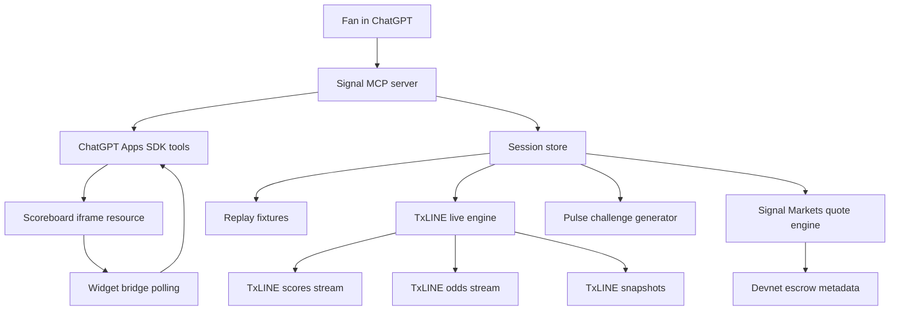

# Signal

Signal is a ChatGPT-native live match companion powered by TxLINE scores and odds.

Instead of shipping another sports-feed website, Signal runs inside ChatGPT as an Apps SDK / MCP app. Fans can open a World Cup scoreboard, ask what is happening in natural language, lock a short Pulse Challenge prediction, and prepare devnet Signal Markets quotes backed by TxLINE match state.

**Live deployment**

- App health: [https://signaltxline.onrender.com/health](https://signaltxline.onrender.com/health)
- MCP endpoint: `https://signaltxline.onrender.com/mcp`
- Current target network: TxLINE `devnet`
- Project state documented on: **July 19, 2026**

## Why Signal

Most football fans watch with a phone in their hand, but existing score apps mostly answer one question: what just happened?

Signal adds a second layer:

- What does this moment mean?
- How is the market reacting?
- What should I watch for next?
- Can I make a simple prediction before the next TxLINE signal arrives?

For the TxODDS / Superteam Consumer and Fan Experiences track, the differentiator is that Signal is not primarily a website. It is a ChatGPT companion that uses TxLINE as the live data layer and ChatGPT as the fan interface.

## Core Features

- **ChatGPT Apps SDK integration**: MCP server exposes Signal tools and score widgets directly inside ChatGPT.
- **Live TxLINE backend**: persistent Render service connects to TxLINE devnet scores and odds streams.
- **Score-only ChatGPT widget**: light-mode World Cup scoreboard rendered as a ChatGPT iframe.
- **Live scoreboard polling**: the widget refreshes live sessions by calling `get_current_pulse` so new TxLINE state can update the UI during a match.
- **Replay mode**: deterministic France vs Spain and England vs Croatia replay fixtures for demo videos and judge review.
- **Pulse Challenges**: contextual Yes/No prediction prompts generated from score, event, and odds movement.
- **Signal Markets metadata**: devnet escrow-ready quote objects for short prediction windows.
- **TTS-ready summary**: `get_spoken_summary` returns a short script suitable for read-aloud flows.

## Architecture



## ChatGPT Setup

Signal is built as an MCP-backed ChatGPT app. OpenAI's Apps SDK documentation describes this model as an MCP server that exposes tools, structured data, and optional UI resources rendered in ChatGPT.

Useful OpenAI docs:

- [Apps SDK quickstart](https://developers.openai.com/apps-sdk/quickstart)
- [Build your MCP server](https://developers.openai.com/apps-sdk/build/mcp-server)
- [Build your ChatGPT UI](https://developers.openai.com/apps-sdk/build/chatgpt-ui)
- [Developer mode and MCP apps in ChatGPT](https://help.openai.com/en/articles/12584461-developer-mode-and-mcp-apps-in-chatgpt)

### Connect the Deployed App

1. Open ChatGPT.
2. Enable Developer Mode for MCP apps if your account/workspace supports it.
3. Add a new custom MCP app.
4. Use this URL:

```text
https://signaltxline.onrender.com/mcp
```

5. Confirm the app lists Signal tools.
6. In a fresh chat, ask:

```text
Open Signal Live Scoreboard
```

For the controlled replay demo, ask:

```text
Open Signal Scoreboard
```

or:

```text
Open Signal Markets demo
```

### Useful ChatGPT Prompts

```text
Open Signal Live Scoreboard
```

```text
Open Signal match with fixtureId 18257739 in live mode.
```

```text
Show TxLINE live health for Signal.
```

```text
Open Signal Scoreboard
```

```text
Yes, lock my answer.
```

```text
Resolve the next Signal pulse.
```

```text
Put 1 USDC on France to score in the next 10 minutes.
```

## TxLINE Integration

Signal uses TxLINE as the live input layer.

Useful TxLINE docs:

- [TxLINE quickstart](https://txline.txodds.com/documentation/quickstart)
- [World Cup documentation](https://txline.txodds.com/documentation/worldcup)
- [Devnet program documentation](https://txline.txodds.com/documentation/programs/devnet)
- [On-chain validation examples](https://txline.txodds.com/documentation/examples/onchain-validation)
- [Hackathon terms](https://txline.txodds.com/documentation/legal/hackathon-terms)

### Devnet Configuration

Signal currently targets TxLINE devnet:

| Item | Value |
| --- | --- |
| Network | `devnet` |
| API origin | `https://txline-dev.txodds.com` |
| Service level | `1` |
| TxLINE program ID | `6pW64gN1s2uqjHkn1unFeEjAwJkPGHoppGvS715wyP2J` |
| Autostart fixture used in demo | `18257739` |

### Endpoints Used

| Purpose | Endpoint family |
| --- | --- |
| Guest auth | `/auth/guest/start` |
| Token activation | `/api/token/activate` |
| Fixtures | `/api/fixtures/snapshot` |
| Score snapshot | `/api/scores/snapshot/{fixtureId}` |
| Score updates | `/api/scores/updates/{fixtureId}` |
| Score stream | `/api/scores/stream` |
| Odds snapshot | `/api/odds/snapshot/{fixtureId}` |
| Odds stream | `/api/odds/stream` |
| Historical scores | `/api/scores/historical/{fixtureId}` |
| Validation proof lookup | `/api/scores/stat-validation` |

Data requests send:

```text
Authorization: Bearer <guest-jwt>
X-Api-Token: <activated-txline-api-token>
```

If `TXLINE_GUEST_JWT` is empty, Signal requests a fresh guest JWT automatically.

## Prove TxLINE Is Working

Open the live health endpoint:

[https://signaltxline.onrender.com/health](https://signaltxline.onrender.com/health)

Expected TxLINE section:

```json
{
  "configured": true,
  "network": "devnet",
  "apiOrigin": "https://txline-dev.txodds.com",
  "tokenLength": 45,
  "autostartFixtureIds": ["18257739"],
  "health": [
    {
      "fixtureId": "18257739",
      "scoresStatus": "open",
      "oddsStatus": "open"
    }
  ],
  "startupEvents": [
    {
      "fixtureId": "18257739",
      "ok": true
    }
  ]
}
```

Terminal proof:

```bash
curl -ks https://signaltxline.onrender.com/health | jq '.txline'
```

Compact proof:

```bash
curl -ks https://signaltxline.onrender.com/health | jq '{
  configured: .txline.configured,
  network: .txline.network,
  fixture: .txline.autostartFixtureIds[0],
  scoresStatus: .txline.health[0].scoresStatus,
  oddsStatus: .txline.health[0].oddsStatus,
  lastScoresAt: .txline.health[0].lastScoresAt,
  lastOddsAt: .txline.health[0].lastOddsAt,
  startupOk: .txline.startupEvents[0].ok
}'
```

Live monitor:

```bash
watch -n 5 'curl -ks https://signaltxline.onrender.com/health | jq ".txline.health"'
```

`scoresStatus: "open"` and `oddsStatus: "open"` confirm that the backend has active TxLINE stream connections.

## Local Setup

### Requirements

- Node.js 20+
- npm
- A TxLINE activated devnet API token for live mode
- A public HTTPS URL for ChatGPT Developer Mode testing

### Install

```bash
npm install
```

### Environment

Create `.env`:

```env
NODE_ENV=development
SIGNAL_DEFAULT_MODE=replay
APP_PUBLIC_URL=http://localhost:8787

TXLINE_NETWORK=devnet
TXLINE_API_ORIGIN=https://txline-dev.txodds.com
TXLINE_API_TOKEN=
TXLINE_GUEST_JWT=
TXLINE_AUTOSTART_FIXTURE_IDS=18257739
```

Do not commit `.env`.

### Run

```bash
npm run dev
```

Local endpoints:

```text
http://localhost:8787/health
http://localhost:8787/demo
http://localhost:8787/mcp
```

### Test

```bash
npm run build
npm test
```

## TxLINE Devnet Activation

The live backend requires an activated TxLINE API token. The high-level flow is:

1. Use the TxLINE devnet program.
2. Subscribe to the free tier on-chain.
3. Request a guest JWT.
4. Sign the activation message with the same wallet.
5. Call `/api/token/activate`.
6. Put the returned token in `TXLINE_API_TOKEN`.

Signal includes helper scripts:

```bash
npm run txline:devnet:preflight
npm run txline:devnet:subscribe
npm run txline:devnet:first-call
```

See [docs/TXLINE_DEVNET_ACTIVATION.md](docs/TXLINE_DEVNET_ACTIVATION.md) for the full devnet walkthrough.

## Deployment

### Render

Render is the recommended deployment target because Signal needs a long-lived Node process for background TxLINE SSE streams.

The repo includes [render.yaml](render.yaml).

Required Render environment:

```env
NODE_ENV=production
SIGNAL_DEFAULT_MODE=replay
APP_PUBLIC_URL=https://signaltxline.onrender.com

TXLINE_NETWORK=devnet
TXLINE_API_ORIGIN=https://txline-dev.txodds.com
TXLINE_API_TOKEN=<activated devnet token>
TXLINE_GUEST_JWT=
TXLINE_AUTOSTART_FIXTURE_IDS=18257739
```

Build command:

```bash
npm ci && npm run build
```

Start command:

```bash
npm start
```

### Vercel

Vercel can serve stateless MCP requests, but it is not ideal for persistent TxLINE streams. Use Render for the full live stream demo.

Vercel settings:

```text
Framework Preset: Other
Build Command: npm run build
Output Directory: public
Install Command: npm install
```

## MCP Tools

| Tool | Purpose |
| --- | --- |
| `list_live_matches` | List TxLINE fixtures plus replay fixtures |
| `open_signal_live_scoreboard` | Open live TxLINE scoreboard, defaulting to fixture `18257739` |
| `open_signal_scoreboard` | Open France vs Spain score-only replay |
| `open_signal_demo` | Open England vs Croatia replay |
| `open_signal_markets_demo` | Open France vs Spain Signal Markets replay |
| `open_match` | Open a specific live or replay fixture |
| `get_current_pulse` | Return latest session state and challenge |
| `get_txline_live_health` | Return live TxLINE stream health |
| `quote_signal_prediction` | Prepare devnet prediction quote metadata |
| `connect_signal_wallet` | Attach a wallet address to a quote |
| `record_signal_prediction_signature` | Record an externally signed devnet transaction signature |
| `submit_answer` | Lock a Pulse Challenge answer |
| `resolve_pulse` | Advance replay or refresh live state for challenge resolution |
| `get_spoken_summary` | Return a short TTS-ready match summary |

## Demo Flow

### Live Proof

1. Open [health](https://signaltxline.onrender.com/health).
2. Show `configured: true`.
3. Show `scoresStatus: "open"` and `oddsStatus: "open"`.
4. In ChatGPT, ask:

```text
Open Signal Live Scoreboard
```

### Controlled Judge Demo

1. In ChatGPT, ask:

```text
Open Signal Scoreboard
```

2. Ask:

```text
Yes, lock my answer.
```

3. Ask:

```text
Resolve the next Signal pulse.
```

4. Ask:

```text
Put 1 USDC on France to score in the next 10 minutes.
```

This demonstrates the full product loop even if no real match is changing during judging.

## Compliance Boundary

Signal Markets is a hackathon/devnet prototype.

- It does not custody user funds.
- It does not sign transactions for users.
- It does not operate production betting or wagering.
- Devnet escrow metadata is used to demonstrate the intended trustless settlement path.
- Any mainnet or real-money deployment requires proper legal review, licensing, jurisdiction checks, and consumer protection controls.

## Project Structure

```text
src/server/mcp.ts              MCP server, tools, resources, health endpoints
src/server/score-widget.ts     ChatGPT score-only widget HTML
src/txline/client.ts           TxLINE REST/SSE client
src/txline/live-engine.ts      Background live score and odds stream runtime
src/txline/normalizer.ts       TxLINE payload normalization
src/txline/replay.ts           Replay fixtures for demos
src/store/sessions.ts          In-memory match sessions and pulse state
src/pulse/*                    Challenge generation and resolution
src/markets/predictions.ts     Signal Markets quote metadata
scripts/*                      TxLINE devnet activation and first-call helpers
docs/*                         Deployment, TxLINE, and demo notes
```

## Submission Links

- Health endpoint: [https://signaltxline.onrender.com/health](https://signaltxline.onrender.com/health)
- MCP endpoint: `https://signaltxline.onrender.com/mcp`
- Superteam track: [Consumer and Fan Experiences](https://superteam.fun/earn/listing/consumer-and-fan-experiences)
- TxLINE quickstart: [https://txline.txodds.com/documentation/quickstart](https://txline.txodds.com/documentation/quickstart)
- World Cup docs: [https://txline.txodds.com/documentation/worldcup](https://txline.txodds.com/documentation/worldcup)
