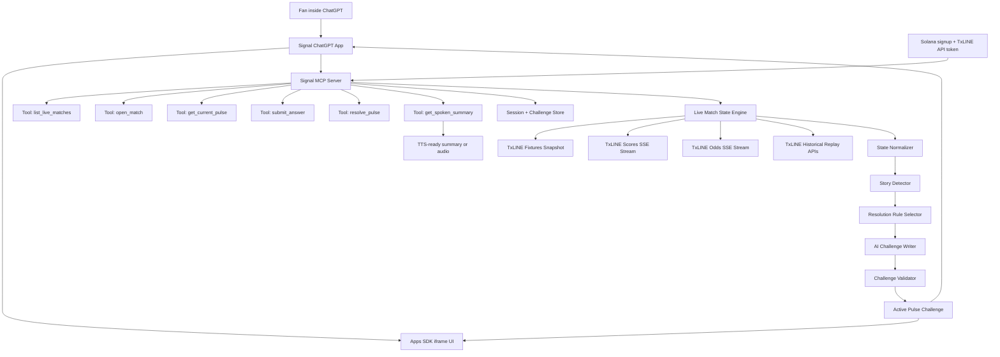
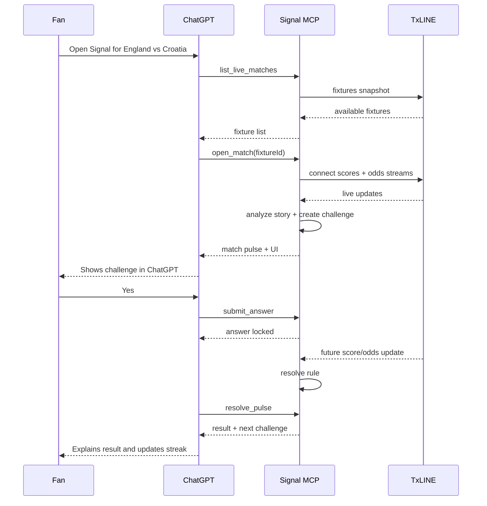

# Signal Project Plan

_Prepared: 2026-07-02_

## 1. One-Line Product

Signal is a ChatGPT-native live World Cup companion that ingests TxLINE scores, events, and odds, explains the live match story in plain English, and creates real-time prediction challenges that resolve automatically from future TxLINE updates.

## 2. Why This Can Win

Most teams will likely build websites, dashboards, or simple score feeds. Signal should be different because the main product surface is ChatGPT itself.

The first-prize version is not "live scores in ChatGPT." It is:

> ChatGPT watching the match with you, reading live TxLINE signals, explaining what the market thinks, and asking one sharp prediction question at the right moment.

This directly maps to the Consumer and Fan Experiences track:

- **Fan Accessibility & UX:** normal fans can play with simple questions like "Will England create the next dangerous spell before halftime?"
- **Real-Time Responsiveness:** the product reacts to TxLINE score, event, and odds streams.
- **Originality & Value Creation:** the core interaction is dynamic AI-generated fan challenges, not another sports data view.
- **Commercial & Monetization Path:** watch-party mode, creator communities, fantasy integrations, sponsor-backed challenges, and premium match companions.
- **Completeness & Execution:** a working ChatGPT app, public MCP endpoint, TxLINE live/replay integration, scoring loop, and demo video.

## 3. Scope Boundary

### In Scope

- ChatGPT-first user experience using OpenAI Apps SDK.
- MCP server exposing Signal tools to ChatGPT.
- TxLINE live fixtures, scores/events, and odds integration.
- Dynamic Pulse Challenge generation from live match context.
- Automatic challenge resolution using future TxLINE updates.
- Replay mode using historical TxLINE data so the demo works after live matches end.
- TTS-ready summaries, with actual audio if time permits.
- Minimal public endpoint/docs for hackathon judging access.

### Out of Scope for MVP

- Betting, wagering, staking, or execution of financial decisions.
- Full standalone sports website.
- Multi-user leagues or social rooms, unless core loop is complete early.
- Deep predictive modeling. The product is a fan experience, not a betting strategy engine.

## 4. Compliance Positioning

We should avoid gambling product language.

Use:

- "prediction challenge"
- "guess"
- "fan streak"
- "market reaction"
- "implied probability"
- "what the crowd/data is pricing in"

Avoid:

- "bet"
- "wager"
- "stake"
- "tip"
- "pick to make money"
- "execute trade"

Signal is a consumer fan game and AI companion. It does not advise users to place bets or execute trades.

## 5. High-Level Architecture



## 6. ChatGPT / Apps SDK Plan

We will use the OpenAI Apps SDK as the ChatGPT integration path.

The app has two layers:

1. **MCP server**
   - Provides tools ChatGPT can call.
   - Connects to TxLINE.
   - Maintains match/challenge session state.
   - Returns structured data and UI resources.

2. **ChatGPT iframe component**
   - Shows the live match pulse inside ChatGPT.
   - Renders scoreboard, odds movement, active challenge, answer buttons, result, and streak.
   - Calls MCP tools through ChatGPT app bridge.

Primary OpenAI references:

- Apps SDK overview: https://developers.openai.com/apps-sdk
- Apps SDK quickstart: https://developers.openai.com/apps-sdk/quickstart
- MCP server guide: https://developers.openai.com/apps-sdk/build/mcp-server
- ChatGPT UI guide: https://developers.openai.com/apps-sdk/build/chatgpt-ui

## 7. TxLINE Integration Plan

Primary TxLINE references:

- Quickstart: https://txline.txodds.com/documentation/quickstart
- World Cup docs: https://txline.txodds.com/documentation/worldcup
- Consumer/Fan track: https://superteam.fun/earn/listing/consumer-and-fan-experiences

Expected TxLINE usage:

| Need | TxLINE source |
| --- | --- |
| Find World Cup matches | Fixtures snapshot endpoint |
| Track live events | Scores SSE stream |
| Track market movement | Odds SSE stream |
| Demo after live match ends | Historical score/odds endpoints |
| Prove hackathon compliance | List exact endpoints in technical docs |

Implementation approach:

1. Create a `TxLineClient`.
2. Add auth/session/token handling from the TxLINE quickstart.
3. Fetch World Cup fixtures.
4. Open score and odds SSE streams for a selected fixture.
5. Normalize updates into one internal `MatchState`.
6. Store recent score events and odds snapshots in memory for MVP.
7. Add historical replay mode using TxLINE historical endpoints for reliable demo video.

## 8. Core Data Model

```ts
type MatchState = {
  fixtureId: string;
  homeTeam: string;
  awayTeam: string;
  minute: number;
  phase: "pre_match" | "first_half" | "halftime" | "second_half" | "fulltime";
  score: {
    home: number;
    away: number;
  };
  recentEvents: MatchEvent[];
  latestOdds: OddsSnapshot | null;
  previousOdds: OddsSnapshot | null;
};

type MatchEvent = {
  id: string;
  minute: number;
  type: "goal" | "yellow_card" | "red_card" | "corner" | "penalty" | "possible_goal" | "other";
  team?: "home" | "away";
  description?: string;
  raw: unknown;
};

type OddsSnapshot = {
  timestamp: string;
  market: string;
  homeProbability?: number;
  drawProbability?: number;
  awayProbability?: number;
  homePrice?: number;
  drawPrice?: number;
  awayPrice?: number;
  raw: unknown;
};

type PulseChallenge = {
  id: string;
  fixtureId: string;
  status: "open" | "locked" | "resolved" | "expired";
  context: string;
  question: string;
  options: string[];
  userAnswer?: string;
  resolutionRule: ResolutionRule;
  createdAtMinute: number;
  deadlineMinute?: number;
};
```

## 9. Dynamic Challenge Engine

The most important product rule:

> The user-facing question must be generated from live match state. It cannot be a fixed generic event-type question.

### Pipeline

```mermaid
flowchart LR
    A["TxLINE score/odds update"] --> B["Normalize MatchState"]
    B --> C["Compute deltas"]
    C --> D["Detect live story"]
    D --> E["Select resolution rule"]
    E --> F["Ask model to write fan-facing question"]
    F --> G["Validate question"]
    G --> H["Show Pulse Challenge in ChatGPT"]
    H --> I["User answers"]
    I --> J["Future TxLINE update resolves challenge"]
```



### Story Detector Signals

The detector should identify:

- **Odds shock:** implied probability changes sharply.
- **Market flip:** favorite changes from one team to another.
- **Pressure spell:** corners, dangerous events, or odds shortening stack up.
- **Team response moment:** a team loses market confidence and needs a response.
- **Discipline tension:** a team or player is under card pressure.
- **Halftime chase:** one team needs a moment before halftime.
- **Late chaos:** a match enters final stages with odds/events moving quickly.
- **Calm after chaos:** several signals hit, then the question is whether the next window settles.

### Resolution Rule Types

The model can write freely, but the backend must choose one of these machine-resolvable rule types first:

```ts
type ResolutionRule =
  | {
      type: "team_gets_next_corner";
      team: "home" | "away";
      deadlineMinute: number;
    }
  | {
      type: "team_scores_before_minute";
      team: "home" | "away";
      deadlineMinute: number;
    }
  | {
      type: "team_gets_next_card";
      team: "home" | "away";
      deadlineMinute: number;
    }
  | {
      type: "team_pressure_response";
      team: "home" | "away";
      deadlineMinute: number;
      signals: Array<"corner" | "goal" | "penalty" | "possible_goal" | "major_odds_recovery">;
    }
  | {
      type: "odds_reversal";
      team: "home" | "away";
      minProbabilityMove: number;
      deadlineMinute: number;
    }
  | {
      type: "no_major_change";
      windowMinutes: number;
      maxProbabilityMove: number;
    };
```

### Challenge Examples

These are examples of output style, not hardcoded questions.

```json
{
  "context": "England's implied win probability dropped from 54% to 31% after Croatia's pressure spell.",
  "question": "Will England create the next dangerous spell before halftime?",
  "options": ["Yes", "No"],
  "resolutionRule": {
    "type": "team_pressure_response",
    "team": "home",
    "deadlineMinute": 45,
    "signals": ["corner", "possible_goal", "penalty", "major_odds_recovery"]
  }
}
```

```json
{
  "context": "Croatia have won two corners in four minutes and the market is moving toward them.",
  "question": "Will Croatia turn this pressure into the next clear match signal?",
  "options": ["Yes", "No"],
  "resolutionRule": {
    "type": "team_pressure_response",
    "team": "away",
    "deadlineMinute": 38,
    "signals": ["corner", "goal", "penalty", "possible_goal"]
  }
}
```

## 10. MCP Tool Contracts

### `list_live_matches`

Purpose: show available World Cup matches.

Input:

```json
{}
```

Output:

```json
{
  "matches": [
    {
      "fixtureId": "string",
      "homeTeam": "England",
      "awayTeam": "Croatia",
      "status": "live",
      "minute": 28,
      "score": "0-0"
    }
  ]
}
```

### `open_match`

Purpose: start a Signal session for one fixture.

Input:

```json
{
  "fixtureId": "string",
  "mode": "live"
}
```

Output:

```json
{
  "sessionId": "string",
  "matchState": {},
  "initialPulse": {}
}
```

### `get_current_pulse`

Purpose: return latest match state, market explanation, and active challenge.

Input:

```json
{
  "sessionId": "string"
}
```

Output:

```json
{
  "matchState": {},
  "marketExplanation": "England's win probability has fallen after Croatia pressure.",
  "challenge": {}
}
```

### `submit_answer`

Purpose: lock a user's answer to the active Pulse Challenge.

Input:

```json
{
  "sessionId": "string",
  "challengeId": "string",
  "answer": "Yes"
}
```

Output:

```json
{
  "status": "locked",
  "message": "Answer locked. Waiting for the next TxLINE signal."
}
```

### `resolve_pulse`

Purpose: resolve the active challenge when new TxLINE updates satisfy or expire the rule.

Input:

```json
{
  "sessionId": "string",
  "challengeId": "string"
}
```

Output:

```json
{
  "resolved": true,
  "correct": true,
  "result": "England created the next pressure signal with a corner in the 34th minute.",
  "streak": 3,
  "nextChallenge": {}
}
```

### `get_spoken_summary`

Purpose: generate a short TTS-ready recap.

Input:

```json
{
  "sessionId": "string",
  "challengeId": "string"
}
```

Output:

```json
{
  "script": "England answered the pressure with a corner in the 34th minute. Your read was right, and the market has started to move back toward them.",
  "audioUrl": "optional"
}
```

## 11. ChatGPT User Flow



## 12. ChatGPT UX Requirements

The in-ChatGPT experience should include:

- Compact scoreboard.
- Match clock and status.
- Latest TxLINE event.
- Odds/probability movement summary.
- One active Pulse Challenge.
- Two or three simple answer buttons.
- Locked answer state.
- Resolution card.
- Streak/score.
- Read-aloud button or TTS-ready summary.

Tone:

- Plain English.
- Football fan language.
- No technical API language.
- No betting instruction language.
- Short enough to read during a live match.

## 13. Replay Mode

Replay mode is mandatory for the demo because the hackathon notes say judges may review after matches are no longer live.

Replay requirements:

- Select a historical World Cup fixture.
- Replay TxLINE score and odds updates in accelerated time.
- Generate challenges from the replayed data, not static mock text.
- Resolve answers from future replay updates.
- Show clearly in the demo that the same engine works with live TxLINE streams.

Implementation:

```ts
type MatchMode = "live" | "replay";
```

For `live`, consume TxLINE SSE streams.

For `replay`, pull historical score/odds updates and emit them through the same internal event bus.

## 14. Build Milestones

### Milestone 1: Project Skeleton

Goal: create the base app and make ChatGPT able to call one MCP tool.

Deliverables:

- Node/TypeScript project.
- Apps SDK MCP server.
- `list_live_matches` returns placeholder data.
- Public local tunnel/dev URL.
- Basic README setup instructions.

Acceptance:

- ChatGPT Developer Mode can connect to the MCP endpoint.
- ChatGPT can call `list_live_matches`.

### Milestone 2: TxLINE Connection

Goal: fetch real TxLINE data.

Deliverables:

- TxLINE auth/token configuration.
- Fixtures snapshot integration.
- Score stream integration.
- Odds stream integration.
- Normalized `MatchState`.

Acceptance:

- Backend can show real fixture list.
- Backend receives score or odds updates for a selected fixture.
- Raw TxLINE payloads are logged only in dev mode.

### Milestone 3: Dynamic Challenge Engine

Goal: create non-generic questions from live data.

Deliverables:

- Story detector.
- Resolution rule selector.
- AI question writer.
- Challenge validator.
- In-memory challenge state.

Acceptance:

- Challenges include live match context.
- Every question has a machine-readable resolution rule.
- Generic questions like "Will the next signal be a goal/card/corner?" are rejected.

### Milestone 4: Challenge Resolution

Goal: make the game loop work.

Deliverables:

- `submit_answer`.
- `resolve_pulse`.
- Streak/score logic.
- Expiry/deadline handling.
- Next challenge generation after resolution.

Acceptance:

- User can answer.
- Answer locks.
- Future TxLINE/replay update resolves the challenge.
- Correct/incorrect result is explained in plain English.

### Milestone 5: ChatGPT UI

Goal: make the experience feel productized inside ChatGPT.

Deliverables:

- Apps SDK iframe component.
- Scoreboard.
- Odds movement panel.
- Challenge card.
- Answer buttons.
- Result/streak card.
- TTS summary button or voice-ready script.

Acceptance:

- The experience is usable inside ChatGPT.
- The UI is compact and polished.
- All actions can be performed without leaving ChatGPT.

### Milestone 6: Replay Demo

Goal: make judging reliable.

Deliverables:

- Replay mode endpoint/tool option.
- One curated replay fixture.
- Accelerated update playback.
- Demo script.

Acceptance:

- A full challenge loop can be shown even without a live match.
- The demo shows TxLINE data powering the experience.

### Milestone 7: Submission Package

Goal: meet all hackathon requirements.

Deliverables:

- Public repo.
- Public MCP endpoint.
- Working ChatGPT app instructions.
- Brief technical documentation.
- List of TxLINE endpoints used.
- Feedback on TxLINE API experience.
- Demo video under 5 minutes.

Acceptance:

- Submission has a working link or functional API endpoint.
- Demo video clearly shows problem, walkthrough, and TxLINE backend.
- The product is functional, not a mockup.

## 15. Demo Video Script

Target length: 3 to 5 minutes.

### Segment 1: Problem

"Most fans watch football with a phone in their hand, but live score apps tell you what happened without helping you understand the momentum. Signal turns TxLINE live scores and odds into an AI match companion inside ChatGPT."

### Segment 2: Start Signal

Show ChatGPT:

> Open Signal for England vs Croatia.

ChatGPT lists/opens the match and renders the Signal UI.

### Segment 3: TxLINE Update Creates Challenge

Show:

- Score.
- Minute.
- Odds/probability movement.
- Signal explanation.
- Generated question.

Example:

"England's implied win probability dropped from 54% to 31% after Croatia pressure. Will England create the next dangerous spell before halftime?"

### Segment 4: Fan Answers

Click/tell ChatGPT:

> Yes.

Show answer locked.

### Segment 5: Resolution

Replay/live TxLINE update arrives.

Show:

- challenge resolved
- explanation
- streak update
- next challenge generated
- TTS summary

### Segment 6: Technical Proof

Briefly show:

- TxLINE fixture endpoint.
- Scores stream.
- Odds stream.
- Replay mode using historical data.
- Apps SDK/MCP endpoint.

### Segment 7: Close

"This is not a website dashboard. It is a ChatGPT-native fan experience powered by TxLINE's live sports data layer."

## 16. Submission Checklist

- [ ] Public GitHub repo.
- [ ] Public MCP endpoint or deployed app endpoint.
- [ ] ChatGPT app setup instructions.
- [ ] TxLINE credentials configured via environment variables.
- [ ] Live fixture flow works.
- [ ] Replay fixture flow works.
- [ ] Dynamic challenge generation works.
- [ ] Challenge resolution works.
- [ ] No betting/wagering language in product UI.
- [ ] Demo video under 5 minutes.
- [ ] Technical documentation lists TxLINE endpoints used.
- [ ] Feedback section for TxLINE API included.

## 17. Environment Variables

Exact names can change once implementation starts, but the project should likely need:

```bash
TXLINE_API_BASE_URL=
TXLINE_API_TOKEN=
TXLINE_CLIENT_ID=
TXLINE_CLIENT_SECRET=
OPENAI_API_KEY=
APP_PUBLIC_URL=
NODE_ENV=
```

## 18. Repo Structure Proposal

```text
matchpulse/
  src/
    server/
      mcp.ts
      tools/
        list-live-matches.ts
        open-match.ts
        get-current-pulse.ts
        submit-answer.ts
        resolve-pulse.ts
        get-spoken-summary.ts
      txline/
        client.ts
        fixtures.ts
        scores-stream.ts
        odds-stream.ts
        replay.ts
        normalize.ts
      pulse/
        story-detector.ts
        resolution-rules.ts
        challenge-writer.ts
        challenge-validator.ts
        resolver.ts
      store/
        sessions.ts
    ui/
      index.html
      main.tsx
      components/
        Scoreboard.tsx
        OddsPulse.tsx
        ChallengeCard.tsx
        ResultCard.tsx
  docs/
    SUBMISSION.md
    TXLINE_ENDPOINTS.md
    DEMO_SCRIPT.md
  SIGNAL_PLAN.md
  README.md
```

## 19. Main Risks and Mitigations

| Risk | Mitigation |
| --- | --- |
| Judges cannot easily access ChatGPT app | Provide public MCP endpoint, clear setup instructions, and demo video. |
| No live match during review | Build replay mode from TxLINE historical endpoints. |
| Questions feel generic | Add validator that rejects generic event-type prompts. |
| Questions cannot be resolved | Generate resolution rule first, then ask AI to phrase the question. |
| TxLINE auth/API friction | Build adapter layer and keep one replay fixture working early. |
| Product is mistaken for betting advice | Use fan-game language and avoid wagering calls to action. |
| Scope grows too large | Keep MVP to one-match live/replay, one active challenge, streak, explanation, TTS summary. |

## 20. Immediate Next Steps

When we start building:

1. Scaffold the TypeScript Apps SDK/MCP project.
2. Implement `list_live_matches` with placeholder data.
3. Connect ChatGPT Developer Mode to the local/public MCP endpoint.
4. Add TxLINE fixtures.
5. Add TxLINE live/replay streams.
6. Implement the dynamic challenge engine.
7. Build the ChatGPT iframe UI.
8. Record a replay-backed demo.

