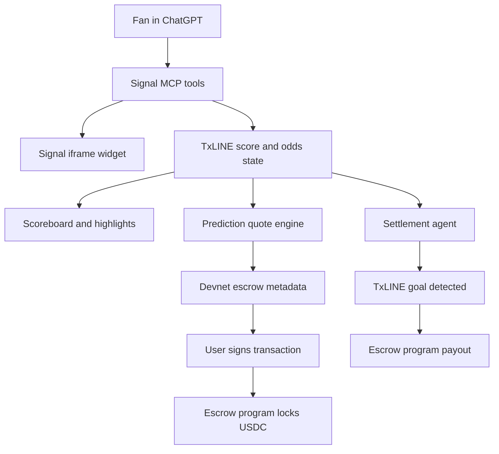

# Signal Markets

Signal Markets is the ChatGPT-native prediction-market version of Signal.

The product opens inside ChatGPT, reads TxLINE match data, shows a simple scoreboard with three recent highlights, and turns natural-language intent into a short-duration devnet escrow position.

## ChatGPT Flow

1. User types:

```text
/signal
```

2. ChatGPT opens the Signal Markets app with `open_signal_markets_demo`.
3. The widget shows:

- match score and clock
- three TxLINE-derived highlights
- current market/odds explanation
- active devnet prediction position, if one exists

4. User asks in any wording:

```text
Put 1 USDC on France to score in the next 10 minutes.
```

5. ChatGPT maps the request to `quote_signal_prediction`.
6. Signal returns escrow-ready metadata:

- match ID
- market type
- YES/NO side
- stake
- expiry minute
- wallet address, when provided
- TxLINE settlement rule
- devnet escrow program ID

## MVP Architecture



## Tools

| Tool | Purpose |
| --- | --- |
| `open_signal_markets_demo` | Opens France vs Spain replay with score/highlights UI |
| `quote_signal_prediction` | Converts natural-language prediction intent into devnet escrow metadata |
| `connect_signal_wallet` | Attaches a Solana wallet address to a quote |
| `record_signal_prediction_signature` | Records an externally signed devnet escrow transaction signature |
| `resolve_pulse` | Advances replay state to show TxLINE settlement-style updates |

## TxLINE Usage

The MVP is designed around the TxLINE documentation index, which lists fixtures, odds, score feeds, Solana program references, streaming examples, and validation examples at `https://txline-docs.txodds.com/llms.txt`.

Production integration uses:

- fixtures snapshot for match selection
- scores stream for goals/cards/corners and settlement outcomes
- odds stream for market movement context
- historical replay for judge demos after matches end
- validation proofs for settlement verification

## Solana Escrow Boundary

For hackathon safety, the current implementation prepares devnet escrow metadata and never signs or moves user funds from the server.

The production escrow program should record:

- match ID
- market: `team_goal_next_window`
- prediction: `YES` or `NO`
- stake amount in USDC
- expiry minute
- wallet address
- settlement authority or proof account

The settlement agent watches TxLINE score events and submits the verified result to the escrow program. Real-money or mainnet operation requires jurisdiction-specific legal review before launch.
